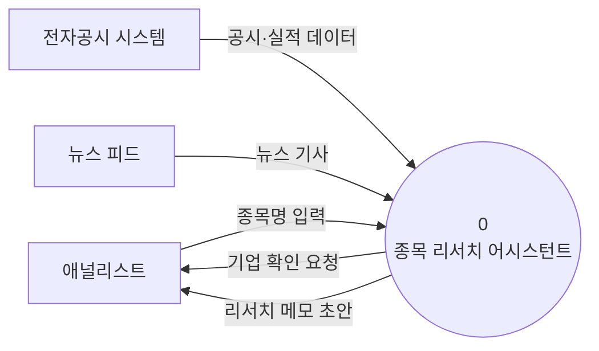
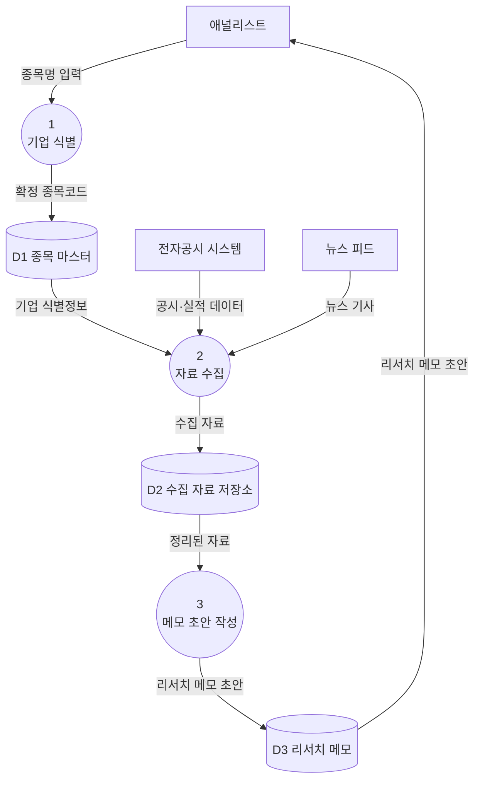

# 구조 다이어그램 — 데이터 흐름도 (DFD)

## 컨텍스트 다이어그램 (Context Diagram)

## Level 0 다이어그램

## 구성요소 명세

### 프로세스 (Processes)
| 번호 | 이름(동사구) | 입력 데이터 흐름 | 출력 데이터 흐름 |
|------|--------------|------------------|------------------|
| 1 | 기업 식별 | 종목명 입력 | 확정 종목코드 |
| 2 | 자료 수집 | 기업 식별정보, 공시·실적 데이터, 뉴스 기사 | 수집 자료 |
| 3 | 메모 초안 작성 | 정리된 자료 | 리서치 메모 초안 |

### 외부 엔티티 (External Entities)
| 이름(명사) | 설명 |
|------------|------|
| 애널리스트 | 종목을 입력하고 메모 초안을 받는 주체 |
| 전자공시 시스템 | 공시·분기 실적 데이터의 공식 출처 |
| 뉴스 피드 | 종목 관련 최신 뉴스 기사 출처 |

### 데이터 스토어 (Data Stores)
| ID | 이름(명사) | 설명 |
|----|------------|------|
| D1 | 종목 마스터 | 종목코드·기업명 등 식별 정보 |
| D2 | 수집 자료 저장소 | 공시·실적·뉴스 원본 및 요약 |
| D3 | 리서치 메모 | 생성된 메모 초안 |
