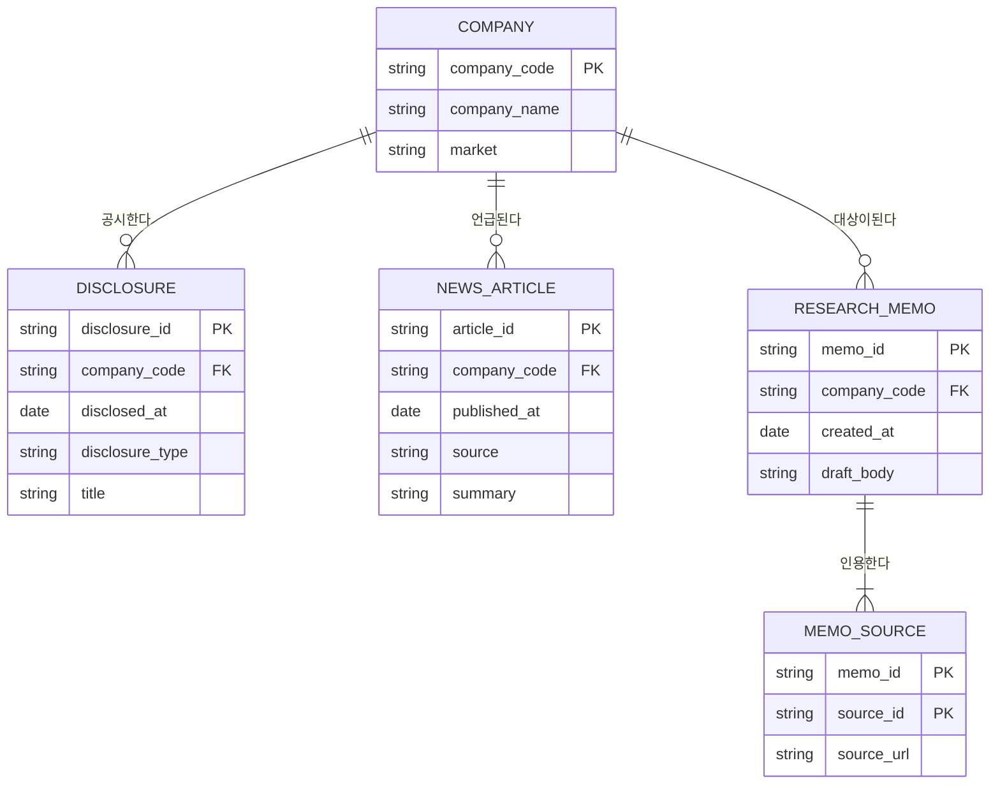

# 데이터 모델 — 개체-관계 다이어그램 (ERD)

## ERD

## 엔티티 명세

| 엔티티 | 식별자(PK) | 주요 속성 | 설명 |
|--------|------------|-----------|------|
| COMPANY | company_code | company_name, market | 분석 대상 상장 기업 |
| DISCLOSURE | disclosure_id | disclosed_at, disclosure_type, title | 기업의 전자공시 1건 |
| NEWS_ARTICLE | article_id | published_at, source, summary | 기업 관련 뉴스 기사 1건 |
| RESEARCH_MEMO | memo_id | created_at, draft_body | 생성된 리서치 메모 초안 |
| MEMO_SOURCE | memo_id + source_id | source_url | 메모가 인용한 출처(교차 엔티티) |

## 관계 명세

| 부모 엔티티 | 관계(동사구) | 자식 엔티티 | 카디널리티 | 모달리티 |
|-------------|--------------|-------------|------------|----------|
| COMPANY | 공시한다 | DISCLOSURE | 1:N | Null |
| COMPANY | 언급된다 | NEWS_ARTICLE | 1:N | Null |
| COMPANY | 대상이 된다 | RESEARCH_MEMO | 1:N | Null |
| RESEARCH_MEMO | 인용한다 | MEMO_SOURCE | 1:N | Not Null |
