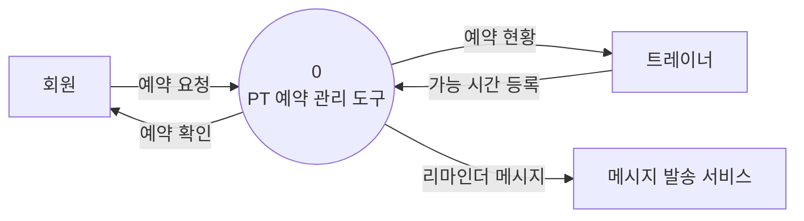
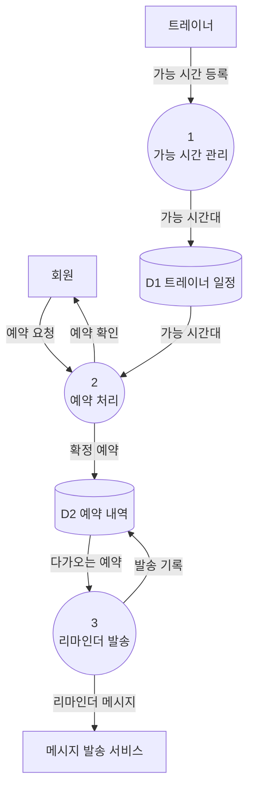

# 구조 다이어그램 — 데이터 흐름도 (DFD)

## 컨텍스트 다이어그램 (Context Diagram)

## Level 0 다이어그램

## 구성요소 명세

### 프로세스 (Processes)
| 번호 | 이름(동사구) | 입력 데이터 흐름 | 출력 데이터 흐름 |
|------|--------------|------------------|------------------|
| 1 | 가능 시간 관리 | 가능 시간 등록 | 가능 시간대 |
| 2 | 예약 처리 | 예약 요청, 가능 시간대 | 확정 예약, 예약 확인 |
| 3 | 리마인더 발송 | 다가오는 예약 | 리마인더 메시지, 발송 기록 |

### 외부 엔티티 (External Entities)
| 이름(명사) | 설명 |
|------------|------|
| 회원 | 예약을 생성·취소하고 리마인더를 받는 주체 |
| 트레이너 | 예약 가능 시간을 등록하고 예약 현황을 확인 |
| 메시지 발송 서비스 | 리마인더를 실제로 전달하는 외부 서비스 |

### 데이터 스토어 (Data Stores)
| ID | 이름(명사) | 설명 |
|----|------------|------|
| D1 | 트레이너 일정 | 트레이너별 예약 가능 시간대 |
| D2 | 예약 내역 | 확정 예약과 출석/노쇼·발송 기록 |
