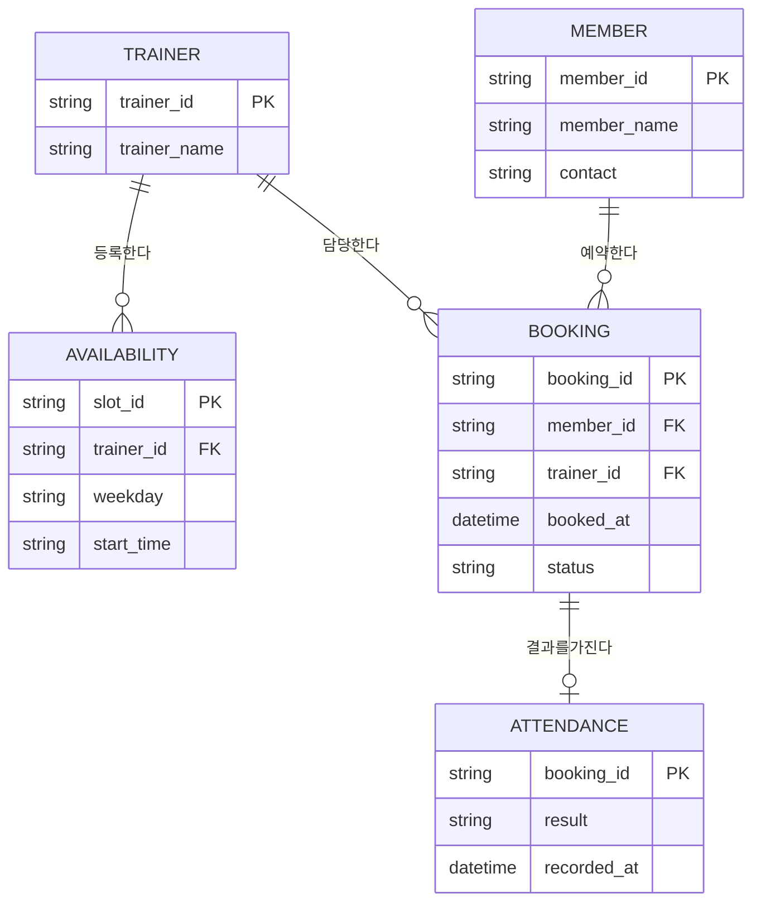

# 데이터 모델 — 개체-관계 다이어그램 (ERD)

## ERD

## 엔티티 명세

| 엔티티 | 식별자(PK) | 주요 속성 | 설명 |
|--------|------------|-----------|------|
| TRAINER | trainer_id | trainer_name | PT를 제공하는 트레이너 |
| MEMBER | member_id | member_name, contact | 예약하는 회원 |
| AVAILABILITY | slot_id | weekday, start_time | 트레이너의 예약 가능 시간대 |
| BOOKING | booking_id | booked_at, status | 확정/취소 상태를 가진 예약 1건 |
| ATTENDANCE | booking_id | result, recorded_at | 예약의 출석/노쇼 결과 |

## 관계 명세

| 부모 엔티티 | 관계(동사구) | 자식 엔티티 | 카디널리티 | 모달리티 |
|-------------|--------------|-------------|------------|----------|
| TRAINER | 등록한다 | AVAILABILITY | 1:N | Null |
| TRAINER | 담당한다 | BOOKING | 1:N | Null |
| MEMBER | 예약한다 | BOOKING | 1:N | Null |
| BOOKING | 결과를 가진다 | ATTENDANCE | 1:1 | Null |
