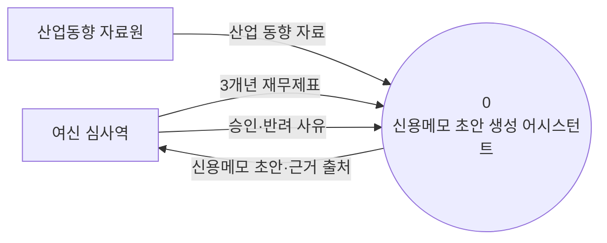
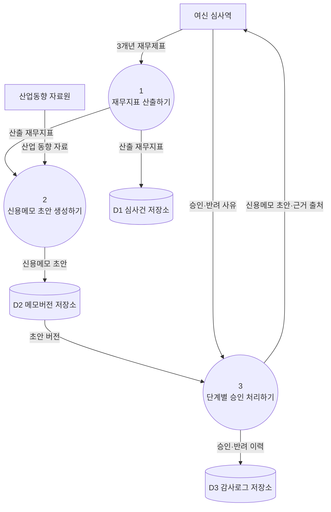

# 구조 다이어그램 — 데이터 흐름도 (DFD)

> 이론(ch05). 구성요소와 데이터 흐름을 텍스트 다이어그램(Mermaid)으로 표현한다.
> 규칙: 모든 프로세스는 입력·출력 데이터 흐름을 각 1개 이상 가진다. 프로세스 이름은 동사구.
> 외부 엔티티·데이터 스토어 이름은 명사. 프로세스 번호 체계(0=context, 1·2·3…=level 0)를 지킨다.

## 컨텍스트 다이어그램 (Context Diagram)

> 전체 시스템을 하나의 프로세스(0)로 표현하고, 모든 외부 엔티티와의 입출력 흐름을 보인다.

## Level 0 다이어그램

> 시스템 내부의 주요 프로세스(1, 2, 3…)와 데이터 스토어(D1, D2…), 그 사이 데이터 흐름을 보인다.

## 구성요소 명세

### 프로세스 (Processes)
| 번호 | 이름(동사구) | 입력 데이터 흐름 | 출력 데이터 흐름 |
|------|--------------|------------------|------------------|
| 1 | 재무지표 산출하기 | 3개년 재무제표 | 산출 재무지표 |
| 2 | 신용메모 초안 생성하기 | 산출 재무지표, 산업 동향 자료 | 신용메모 초안 |
| 3 | 단계별 승인 처리하기 | 초안 버전, 승인·반려 사유 | 신용메모 초안·근거 출처, 승인·반려 이력 |

### 외부 엔티티 (External Entities)
| 이름(명사) | 설명 |
|------------|------|
| 여신 심사역 | 재무제표를 입력하고 초안을 검토·승인하는 주 사용자 |
| 산업동향 자료원 | 업종별 산업 동향·전망 자료를 제공하는 외부 출처 |

### 데이터 스토어 (Data Stores)
| ID | 이름(명사) | 설명 |
|----|------------|------|
| D1 | 심사건 저장소 | 신청 기업·산출 재무지표를 보관 |
| D2 | 메모버전 저장소 | 신용메모 초안의 버전별 본문·근거 출처를 보관 |
| D3 | 감사로그 저장소 | 단계별 승인·반려 이력과 판단 경로를 보관 |
