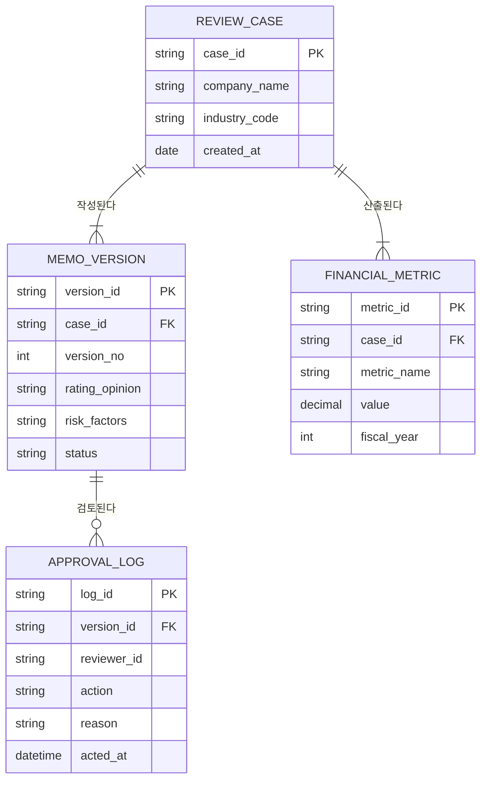

# 데이터 모델 — 개체-관계 다이어그램 (ERD)

> 이론(ch06). 엔티티·속성·관계를 Mermaid erDiagram으로 표현한다.
> 규칙: 각 엔티티는 식별자(PK)를 가진다. 관계는 동사구 이름과 카디널리티(1:1 / 1:N / M:N)를 갖는다.
> DFD의 데이터 스토어와 대체로 대응되어야 한다(balance).

## ERD

## 엔티티 명세

| 엔티티 | 식별자(PK) | 주요 속성 | 설명 | DFD 대응 |
|--------|------------|-----------|------|----------|
| REVIEW_CASE | case_id | company_name, industry_code, created_at | 신청 기업 단위 심사 건 | D1 심사건 저장소 |
| FINANCIAL_METRIC | metric_id | case_id(FK), metric_name, value, fiscal_year | 연도별 산출 재무지표 | D1 심사건 저장소 |
| MEMO_VERSION | version_id | case_id(FK), version_no, rating_opinion, risk_factors, status | 신용메모 초안 버전 | D2 메모버전 저장소 |
| APPROVAL_LOG | log_id | version_id(FK), reviewer_id, action, reason, acted_at | 단계별 승인·반려 이력 | D3 감사로그 저장소 |

## 관계 명세

| 부모 엔티티 | 관계(동사구) | 자식 엔티티 | 카디널리티 | 모달리티 |
|-------------|--------------|-------------|------------|----------|
| REVIEW_CASE | 작성된다 | MEMO_VERSION | 1:N | Not Null |
| REVIEW_CASE | 산출된다 | FINANCIAL_METRIC | 1:N | Not Null |
| MEMO_VERSION | 검토된다 | APPROVAL_LOG | 1:N | Null |
