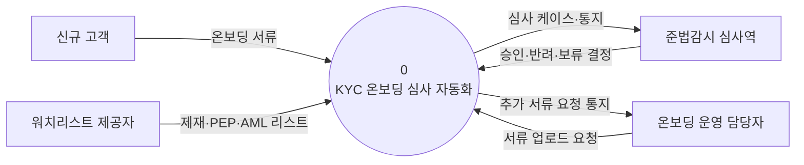
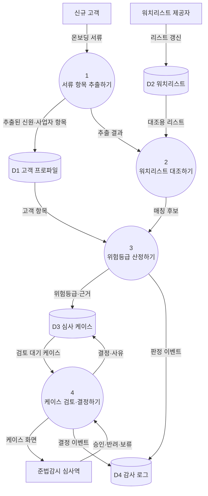

# 구조 다이어그램 — 데이터 흐름도 (DFD)

## 컨텍스트 다이어그램 (Context Diagram)

## Level 0 다이어그램

## 구성요소 명세

### 프로세스 (Processes)
| 번호 | 이름(동사구) | 입력 데이터 흐름 | 출력 데이터 흐름 |
|------|--------------|------------------|------------------|
| 1 | 서류 항목 추출하기 | 온보딩 서류 | 추출된 신원·사업자 항목, 추출 결과 |
| 2 | 워치리스트 대조하기 | 추출 결과, 대조용 리스트 | 매칭 후보 |
| 3 | 위험등급 산정하기 | 매칭 후보, 고객 항목 | 위험등급·근거, 판정 이벤트 |
| 4 | 케이스 검토·결정하기 | 검토 대기 케이스, 승인·반려·보류 | 케이스 화면, 결정·사유, 결정 이벤트 |

### 외부 엔티티 (External Entities)
| 이름(명사) | 설명 |
|------------|------|
| 신규 고객 | 온보딩을 위해 신원·사업자·소득 서류를 제출하는 주체 |
| 온보딩 운영 담당자 | 서류를 업로드하고 추가 서류 요청을 처리하는 운영자 |
| 준법감시 심사역 | 자동 생성된 케이스를 검토하고 최종 결정을 내리는 사람 |
| 워치리스트 제공자 | 제재·PEP·AML 명단을 공급하는 공인 출처 |

### 데이터 스토어 (Data Stores)
| ID | 이름(명사) | 설명 |
|----|------------|------|
| D1 | 고객 프로파일 | 서류에서 추출된 고객 신원·사업자·소득 항목 |
| D2 | 워치리스트 | 제재·PEP·AML 명단과 그 버전 정보 |
| D3 | 심사 케이스 | 위험등급·근거·결정 이력을 담은 온보딩 심사 단위 |
| D4 | 감사 로그 | 모든 판정·결정 이벤트의 불변 기록 |
