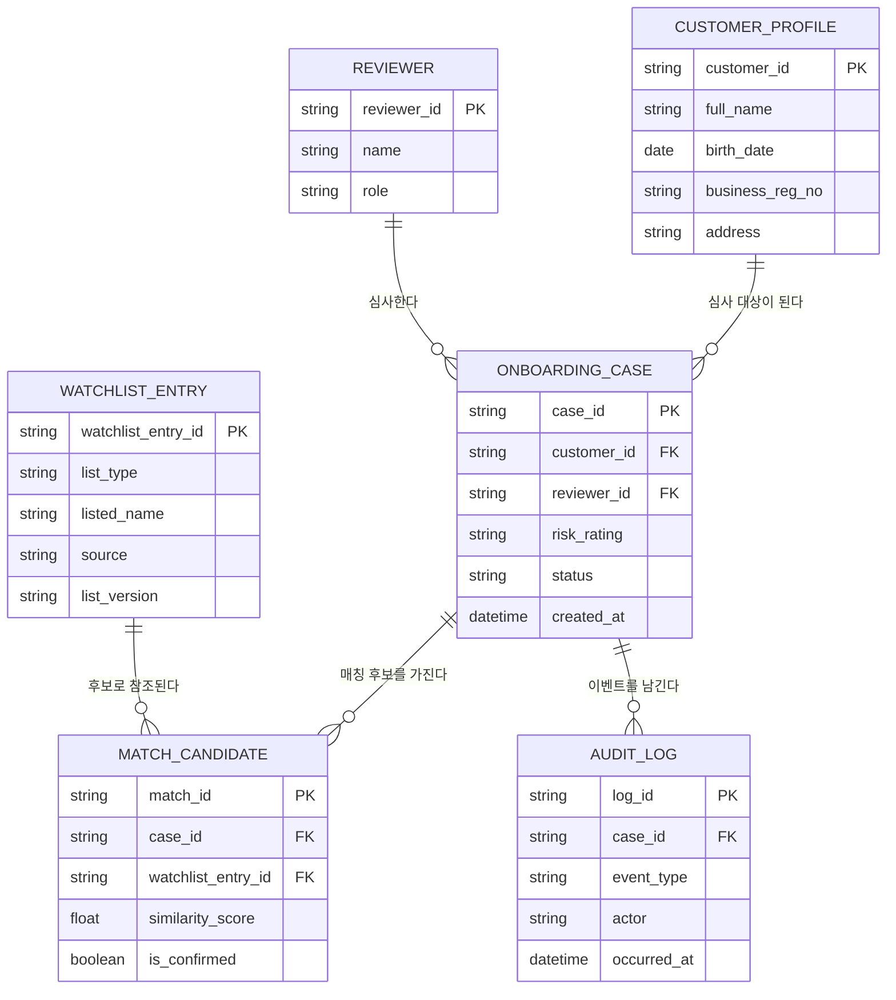

# 데이터 모델 — 개체-관계 다이어그램 (ERD)

## ERD

## 엔티티 명세

| 엔티티 | 식별자(PK) | 주요 속성 | 설명 |
|--------|------------|-----------|------|
| CUSTOMER_PROFILE | customer_id | full_name, birth_date, business_reg_no, address | 서류에서 추출된 고객 신원·사업자 정보 (DFD D1) |
| ONBOARDING_CASE | case_id | risk_rating, status, created_at | 온보딩 심사 단위, 위험등급·상태 보유 (DFD D3) |
| MATCH_CANDIDATE | match_id | similarity_score, is_confirmed | 케이스-워치리스트 대조로 발견된 매칭 후보 |
| WATCHLIST_ENTRY | watchlist_entry_id | list_type, listed_name, source, list_version | 제재·PEP·AML 명단 항목 (DFD D2) |
| REVIEWER | reviewer_id | name, role | 케이스를 검토·결정하는 심사역 |
| AUDIT_LOG | log_id | event_type, actor, occurred_at | 판정·결정 이벤트의 불변 기록 (DFD D4) |

## 관계 명세

| 부모 엔티티 | 관계(동사구) | 자식 엔티티 | 카디널리티 | 모달리티 |
|-------------|--------------|-------------|------------|----------|
| CUSTOMER_PROFILE | 심사 대상이 된다 | ONBOARDING_CASE | 1:N | Not Null |
| ONBOARDING_CASE | 매칭 후보를 가진다 | MATCH_CANDIDATE | 1:N | Null |
| WATCHLIST_ENTRY | 후보로 참조된다 | MATCH_CANDIDATE | 1:N | Null |
| REVIEWER | 심사한다 | ONBOARDING_CASE | 1:N | Null |
| ONBOARDING_CASE | 이벤트를 남긴다 | AUDIT_LOG | 1:N | Not Null |
